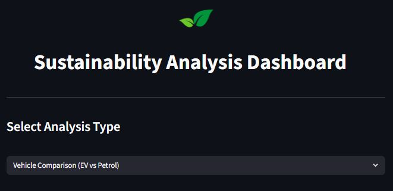
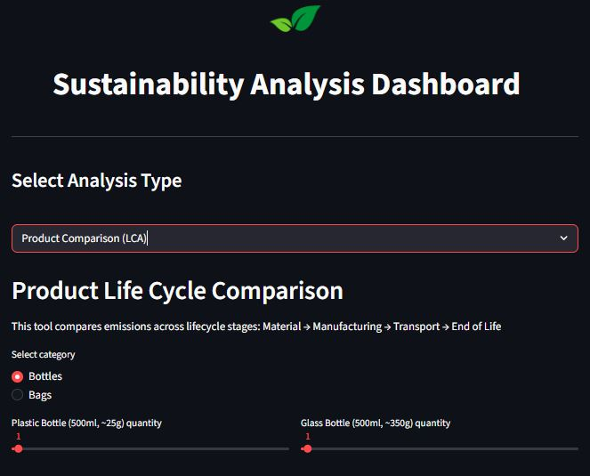
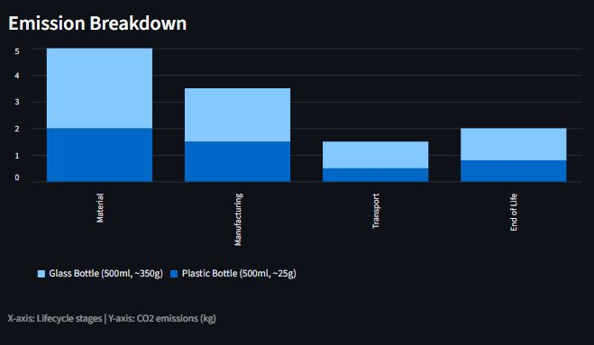
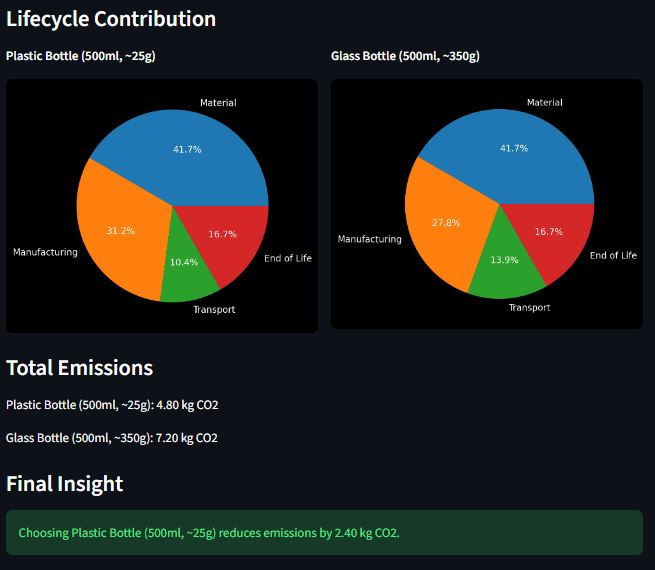
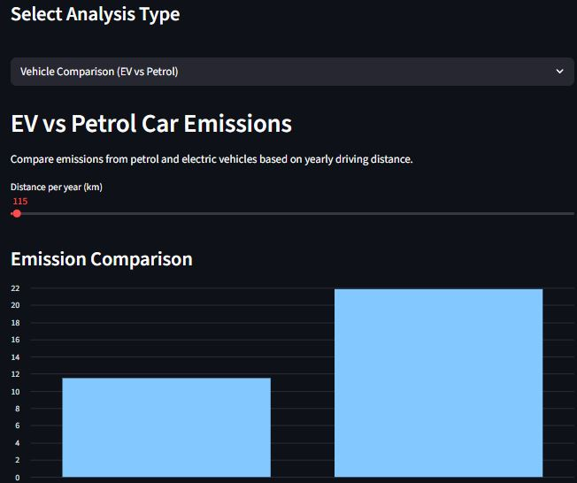

# Sustainability Analysis Dashboard

Live App: https://sustainability-analysis-dashboard-bjyegsq9ndte9j2zkhav8u.streamlit.app/

An interactive web application built using Python and Streamlit to explore carbon emissions from everyday decisions.

This tool focuses on two key areas:
- Product lifecycle emissions (LCA)
- Vehicle emissions comparison (EV vs Petrol)

---

## Preview

---

## Product Life Cycle Comparison (LCA)

This section compares emissions across lifecycle stages:

Material → Manufacturing → Transport → End of Life

Users can:
- Select product category (bottles or bags)
- Adjust quantity using sliders
- Compare emissions between two products

### Features
- Emission breakdown using bar charts  
- Lifecycle contribution using pie charts  
- Total emissions comparison  
- Final recommendation based on results  

  
  

---

## EV vs Petrol Vehicle Comparison

This section estimates yearly emissions based on driving distance.

### Assumptions
- Petrol car: 0.19 kg CO2 per km  
- Electric vehicle: 0.10 kg CO2 per km  

### Features
- Adjustable yearly distance  
- Emission comparison chart  
- Clear numerical results  
- Insight on emission savings  

---

## How It Works

### Product Emissions  
Total emissions = sum of (stage emissions × quantity)

### Vehicle Emissions  
Emissions = distance × emission factor

---

## Project Structure
sustainability-analysis-dashboard/
├── app.py
├── README.md
├── requirements.txt
├── logo.png
└── images/

---

## How to Run

Make sure Python 3.11+ is installed
pip install -r requirements.txt
streamlit run app.py
---

## Technologies Used

- Python  
- Streamlit  
- Pandas  
- Matplotlib  

---

## Disclaimer

This model uses simplified emission factors and average values to estimate lifecycle emissions for representative products.
It is intended for learning and comparison, not precise environmental assessment.

---

## Future Improvements

- Region-specific emission factors  
- More product categories  
- Export results functionality  
- Improved data accuracy  

---

## Author

Abhay Gulabrao Borse  
M.Sc. Environmental and Resource Management  
BTU Cottbus-Senftenberg
